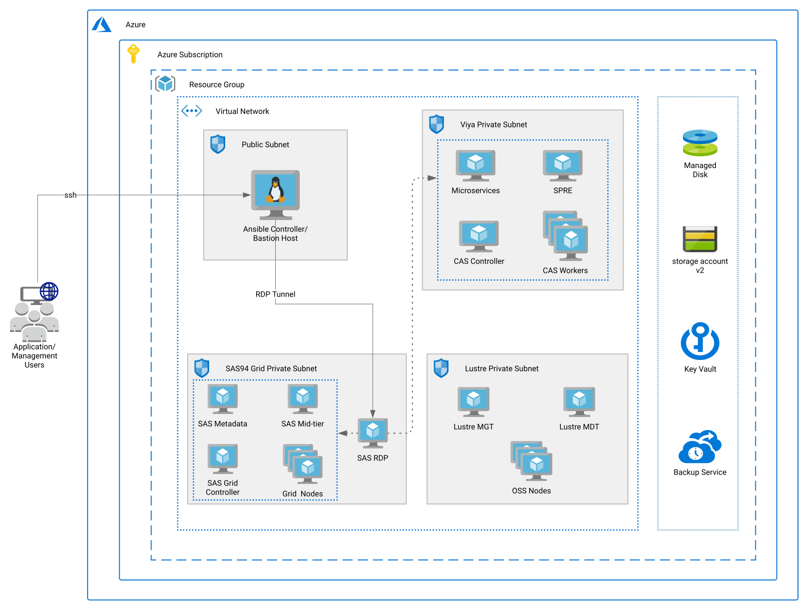

# SAS 9 Grid Manager for Platform + Viya Quickstart Template for Azure
This README for SAS 9 Grid Manager for Platform + Viya Quickstart Template for Azure is used to deploy the following SAS 9 Grid Manager for Platform + Viya products in the Azure cloud. Refer [SAS QuickStart Deployment Guide](https://github.com/corecompete/sas94grid-viya/blob/master/SAS-Quick-Start-On-Azure_v1.pdf) for detailed steps.

## SAS 9 Components
* SAS Enterprise BI Server 9.4
* SAS Enterprise Miner 15.1
* SAS Enterprise Guide 8.2 
* SAS Data Integration Server 9.4 
* SAS Grid Manager for Platform 9.44 
* SAS Office Analytics 7.4
* Platform Suite for SAS 10.11

## SAS Viya
* SAS Visual Analytics 8.5 on Linux
* SAS Visual Statistics 8.5 on Linux
* SAS Visual Data Mining and Machine Learning 8.5 on Linux
* SAS Data Preparation 2.5

This Quickstart is a reference architecture for users who want to deploy the SAS 9 Grid Manager for Platform + Viya platform, using microservices and other cloud-friendly technologies. By deploying the SAS platform in Azure, you get SAS analytics, data visualization, and machine-learning capabilities in an Azure-validated environment. 

## Contents
- [SAS 9 Grid Manager for Platform + Viya Quickstart Template for Azure](#sas9-Grid-Manager-for-Platform-viya-quickstart-template-for-azure)
  - [Solution Summary](#Summary)
    - [Objective](#Objective)
    - [Architecture Overview](#Overview)
    - [Architecture Diagram](#Architecture)
  - [Pre-Requisites](#prerequisites)
    - [Download SAS Software for 9.4 and Viya](#Download)
    - [Upload the SAS Software to an Azure File Share](#Upload)
    - [Best Practices When Deploying SAS Viya on Azure](#Best)
  - [Deployment Steps](#Deploy)
  
  

## Solution Summary
This QuickStart is intended to help SAS customers deploy a cloud-native environment that provides both SAS 9.4 Grid Manager for Platform and the SAS Viya 3.5 platform in an integrated environment. It is intended to provide an easy way for customers to get a comprehensive SAS environment, that will likely result in faster migrations and deployments into the Azure environment. The SAS ecosystem is deployed on the Azure platform, leveraging Azure native deployment approaches. As part of the deployment, you get all the powerful data management, analytics, and visualization capabilities of SAS, deployed on a high-performance infrastructure.

### Objective
The SAS 9 Grid Manager for Platform & Viya QuickStart for Azure will take a SAS provided license package for SAS 9 Grid Manager, Viya and deploy a well-architected SAS platform into the customer’s Azure subscription. The deployment creates a virtual network and other required infrastructure. After the deployment process completes, you will have the necessary details for the endpoints and connection details to log in to the new SAS Ecosystem. By default, QuickStart deployments enable Transport Layer Security (TLS) for secure communication

### Architecture Overview
The QuickStart will setup the following environment on Microsoft Azure:
* A Virtual Network (VNet) configured with public and private subnets. This provides the network infrastructure for your SAS 9 Grid Manager for Platform and SAS Viya deployments.
* In the public subnet, a Linux bastion host acting as an Ansible Controller Host.
* In the private subnet, a Remote Desktop instance acting as a Client Machine.
* In the Application subnets (private subnet), Virtual Machines for:
	* SAS 9 Grid Platform – Metadata, Grid Compute and Mid-Tier
	* Lustre Platform - Management Service(MDT), Metadata Service(MDS) and Object Storage Service(OSS) 
	* SAS Viya – Microservices, SPRE, CAS Controller and CAS Workers
* Disks required for SAS Binaries, Configuration, and Data will be provisioned using Premium Disks in Azure.
* Security groups for Virtual Machines and Subnets.
* Accelerated Networking is enabled on all the network interfaces.
* All the servers are placed in the same proximity placement group.

### Architecture Diagram

## Prerequisites
Before deploying SAS Quickstart Template for Azure, you must have the following:
* Azure user account with Contributor and Admin Roles
* Sufficient quota of at least 100 Cores based on licensed core for MPP environments ( SAS 9.4 Grid and Viya 3.5)
* A SAS Software Order Confirmation Email that contains supported Quickstart products:
 
	The license file {emailed from SAS as SAS_Viya_deployment_data.zip} which describes your SAS Software Order.
	SAS 9.4 Grid software order details required to download the sasdepot.
 
* A resource group that does not already contain a Quickstart deployment. For more information, see [Resource groups](https://docs.microsoft.com/en-us/azure/azure-resource-manager/resource-group-overview#resource-groups). 
* All the Server types you select must support [Accelerated Networking](https://azure.microsoft.com/en-us/updates/accelerated-networking-in-expanded-preview/) and [Premium Storage](https://docs.microsoft.com/en-us/azure/virtual-machines/disks-types#premium-ssd)
* Refer [SAS QuickStart Deployment Guide](https://github.com/corecompete/sas94grid-viya/blob/master/SAS-Quick-Start-On-Azure_v1.pdf) for more information.

### Download SAS Software for 9.4 Grid and Viya
* Follow the SAS Instructions to [download the SAS 9.4 Software for Grid](https://documentation.sas.com/?docsetId=biig&docsetTarget=n03005intelplatform00install.htm&docsetVersion=9.4&locale=en).
* Follow the SAS Instructions to Create the [SAS Viya Mirror Repository](https://documentation.sas.com/?docsetId=dplyml0phy0lax&docsetTarget=p1ilrw734naazfn119i2rqik91r0.htm&docsetVersion=3.5&locale=en).

	Download SAS Mirror Manager from the [SAS Mirror Manager download site](https://support.sas.com/en/documentation/install-center/viya/deployment-tools/35/mirror-manager.html) to the machine where you want to create your mirror repository and uncompress the downloaded file.

* Run the command to Mirror the SAS viya repository:

		mirrormgr  mirror  --deployment-data  <path-to-SAS_Viya_deployment_data>.zip --path <location-of-mirror-repository> --log-file mirrormgr.log --platform 64-redhat-linux-6  --latest

* Refer [SAS QuickStart Deployment Guide](https://github.com/corecompete/sas94grid-viya/blob/master/SAS-Quick-Start-On-Azure_v1.pdf) for more information.
 

### Upload the SAS Software to an Azure File Share
* Create Azure File Share with premium options. Follow the Microsoft Azure instructions to "[Create a Premium File Share](https://docs.microsoft.com/en-us/azure/storage/files/storage-how-to-create-premium-fileshare?tabs=azure-portal)"
* Upload the SAS_Viya_deployment_data.zip {emailed from SAS} to viyarepo folder where the software for viya is located. Instructions to Mount on [Windows](https://docs.microsoft.com/en-us/azure/storage/files/storage-how-to-use-files-windows), [Mac](https://docs.microsoft.com/en-us/azure/storage/files/storage-how-to-use-files-mac) and [Linux](https://docs.microsoft.com/en-us/azure/storage/files/storage-how-to-use-files-linux).
* The QuickStart deployment requires these list of parameters [ Storage Account Name, File Share Name, SASDepot Folder, Viyarepo Folder, SAS Client License File, SAS Server License File, Storage Account Key ].
* Create two directories for SAS 9.4 Grid depot and SAS Viya repo in the File share(e.g. sasdepot and viyarepo)
* Upload the SAS Software(sasdepot) to sasdepot folder. 
* Get Storage Account Access key. Follow the Microsoft Azure instructions to "[view storage account access key](https://docs.microsoft.com/en-us/azure/storage/common/storage-account-keys-manage?tabs=azure-portal)"
* Refer [SAS QuickStart Deployment Guide](https://github.com/corecompete/sas94grid-viya/blob/master/SAS-Quick-Start-On-Azure_v1.pdf) for more information.
 

### Best Practices When Deploying SAS Viya on Azure
We recommend the following as best practices:
* Create a separate resource group for each Quickstart deployment. For more information, see [Resource groups](https://docs.microsoft.com/en-us/azure/azure-resource-manager/resource-group-overview#resource-groups).
* In resource groups that contain a Quickstart deployment, include only the Quickstart deployment in the resource group to facilitate the deletion of the deployment as a unit.

### Deployment Steps
You can click the "Deploy to Azure" button at the beginning of this document or follow the instructions for a command-line (CLI) deployment using the scripts in the root of this repository.

The deployment takes between 2.5 to 3 hours, depending on the quantity of software licensed.
* Refer [SAS QuickStart Deployment Guide](https://github.com/corecompete/sas94grid-viya/blob/master/SAS-Quick-Start-On-Azure_v1.pdf) for more information.

## Usage
* Refer section 5 in [SAS QuickStart Deployment Guide](https://github.com/corecompete/sas94grid-viya/blob/master/SAS-Quick-Start-On-Azure_v1.pdf)
* SSH Tunneling, please refer section 7.2 in [SAS QuickStart Deployment Guide](https://github.com/corecompete/sas94-viya/blob/master/SAS-Quick-Start-On-Azure_v1.pdf)

